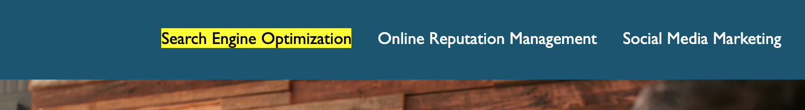
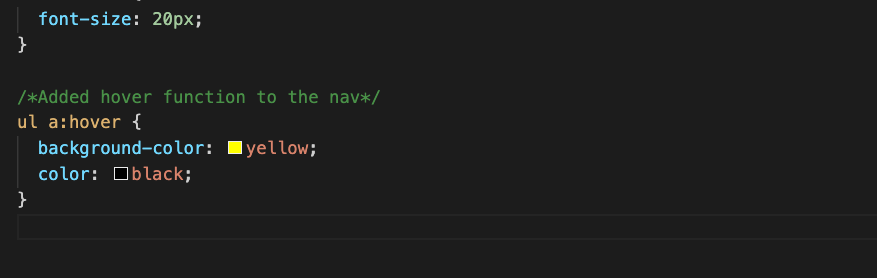
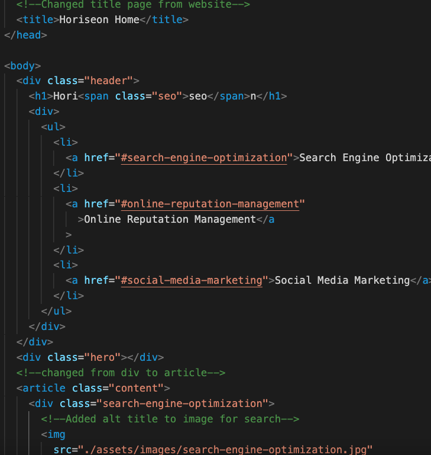
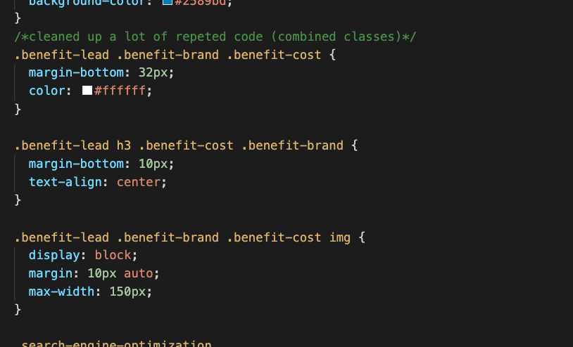
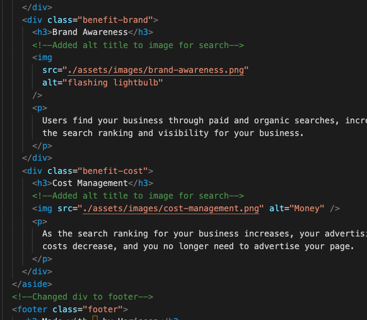

# Horiseon

## Describtion

The company Horiseon wants to improve their accessibility standards and optimize web search results. 
Diving deeper I cleaned up redundant code, added hover functions and optimized html structure making it readable for search engines. 

## Usage

 

One way to improve accessability was to add a hover function, for people with visual disabilities. 

Title name was also added. Text was changed from div to article 

Optimazation of the website. Cleaning up duplicated code and make css more streamlined. 
